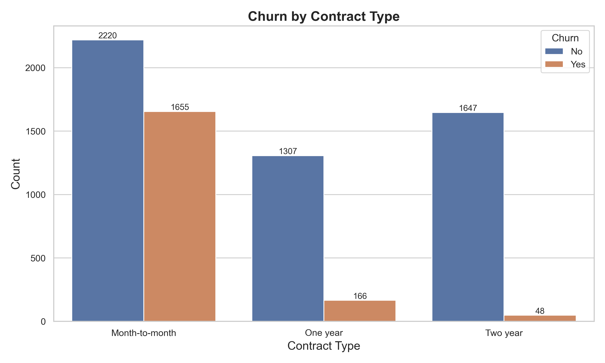
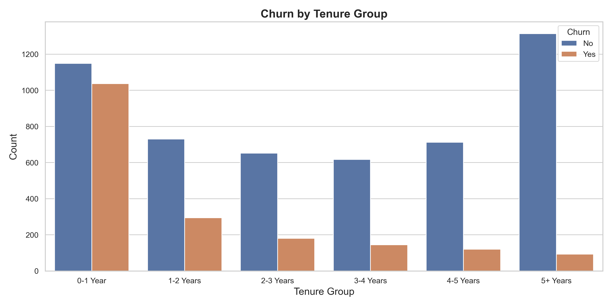
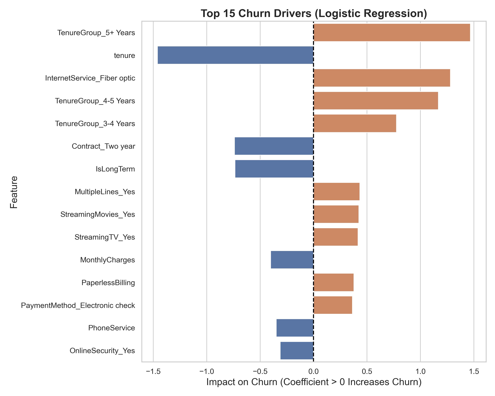

# Customer Churn Analysis: Predictive Modeling & Retention Strategy


## Project Overview
This repository contains a complete, end-to-end data science workflow analyzing customer attrition (churn) for a telecommunications company. The project goes beyond standard exploratory data analysis by building interpretable predictive models to extract exact business drivers, quantifying the revenue at risk, and simulating the financial ROI of a targeted retention strategy.

## Business Problem
Customer churn represents a direct hit to annualized recurring revenue (ARR). The cost of acquiring a new customer is significantly higher than retaining an existing one. This project answers three critical business questions:
1. **Who** is going to churn?
2. **Why** are they churning?
3. **What** is the financial impact, and how can we cost-effectively intervene?

## Dataset Source
The analysis uses the primary **Telco Customer Churn** dataset. 
- **Observations:** 7,043 customers
- **Features:** 21 (including customer demographics, account information, and consumed services)
- **Target:** `Churn` (Yes/No)

## Methodology
1. **Data Preprocessing & Engineering:** Handled edge cases (e.g., zero-tenure blank charges), engineered cohorts for lifecycle analysis, and built a robust scaling and encoding pipeline.
2. **Exploratory Data Analysis (EDA):** Visualized fundamental customer segments to identify high-level churn concentrations.
3. **Predictive Modeling:** Trained and evaluated Logistic Regression and Decision Tree models. Logistic Regression was selected as the primary model due to its high interpretability and straightforward coefficient extraction for business drivers.
4. **Impact Simulation:** Scored the customer base to estimate Monthly Revenue at Risk ($) and simulated a targeted discount campaign to project retained revenue.

## Key Insights
- **Contract Type is King:** Customers on flexible, month-to-month contracts exhibit exponentially higher churn rates compared to those on 1-year or 2-year subscriptions.
- **The First Year is Critical:** Churn risk peaks within the first 12 months of a customer's lifecycle.
- **Service Bundling Increases Stickiness:** Customers subscribing to integrated services (Tech Support, Online Security) are significantly less likely to leave.

### Top Churn Drivers (Logistic Regression Coefficients)

| Rank | Feature | Coefficient | Odds Ratio | Direction |
|------|---------|-------------|------------|-----------|
| 1 | Tenure (months) | −1.4616 | 0.23 | ↓ Reduces churn |
| 2 | Internet Service: Fiber Optic | +1.2812 | 3.60 | ↑ Increases churn |
| 3 | Contract: Two Year | −0.7399 | 0.48 | ↓ Reduces churn |
| 4 | Multiple Lines: Yes | +0.4328 | 1.54 | ↑ Increases churn |
| 5 | Payment Method: Electronic Check | +0.3635 | 1.44 | ↑ Increases churn |

*Coefficients are from a Logistic Regression model trained on standardized features. Positive coefficients indicate higher churn probability; negative coefficients indicate retention.*

## Key Visualizations


*Month-to-month contracts drive ~42% churn vs. under 5% for two-year contracts — contract structure is the single strongest predictor of attrition.*


*Churn risk is heavily front-loaded: customers in their first 12 months account for the majority of attrition, with risk declining sharply after year one.*


*Fiber optic internet, electronic check payments, and lack of bundled services (Tech Support, Online Security) are the strongest service-level churn accelerators.*

## Retention Strategy Recommendations & Business Impact
We simulated the ROI of a targeted retention campaign focusing on customers flagged as high flight-risk who are on month-to-month contracts.
- **Strategy:** Offer a proactive 10% discount if they upgrade to a 1-year contract.
- **Revenue at Risk:** Prior to intervention, roughly **~30%** of total monthly recurring revenue is at risk of churning.
- **Projected ROI:** Assuming a conservative 30% campaign acceptance rate, this strategy is estimated to save **~$33,000 / month** in retained revenue (or roughly $400,000 annualized).

*For a detailed breakdown, please see the [Executive Summary](reports/executive_summary.md).*

## Assumptions & Limitations

- **Campaign acceptance rate (30%)** is based on industry benchmarks for telco win-back campaigns at 10% discount levels, not empirical A/B test results from this dataset.
- **Revenue at risk calculation** assumes the predicted churn probability translates linearly to revenue loss, without accounting for partial-month billing or service downgrades.
- **Logistic Regression was chosen for interpretability** over higher-accuracy models like XGBoost or Random Forest. A production deployment optimizing for prediction accuracy would benchmark multiple models and likely use an ensemble approach.
- **Dataset is a static snapshot** — the Telco Customer Churn dataset captures customer state at a single point in time. Real production systems would require time-series cohort tracking and model retraining as customer behavior evolves.
- **Cross-sell and upsell impact not modeled** — the retention strategy estimates focus on revenue protection from churn prevention, not the secondary value of converted month-to-month customers becoming higher-LTV annual subscribers.

## Tech Stack
- **Data Manipulation:** `pandas`, `numpy`
- **Machine Learning:** `scikit-learn` (Logistic Regression, Decision Trees)
- **Data Visualization:** `matplotlib`, `seaborn`
- **Environment:** Jupyter Notebooks (`nbformat`)

## How to Run
1. **Clone the repository:**
   ```bash
   git clone <repository-link>
   cd customer-churn-analysis
   ```

2. **Install dependencies:**
   ```bash
   pip install -r requirements.txt
   ```

3. **Generate Analysis & Visualizations:**
   Run the core analytical scripts to preprocess data, train models, and generate the presentation-ready visuals (saved to `/visuals`).
   ```bash
   python src/eda_analysis.py
   python src/churn_model.py
   python src/retention_strategy.py
   ```

4. **Explore the Notebooks:**
   Launch Jupyter to view the structured analytical narratives:
   ```bash
   jupyter notebook notebooks/
   ```

## Repository Structure
```text
customer-churn-analysis/
│
├── data/                       # Raw datasets
├── notebooks/                  # Structured analytical narratives 
│   ├── 01_exploration.ipynb
│   └── 02_modeling.ipynb
├── reports/                    # Business documentation
│   └── executive_summary.md
├── src/                        # Core Python modules
│   ├── churn_model.py
│   ├── data_preprocessing.py
│   ├── eda_analysis.py
│   └── retention_strategy.py
├── visuals/                    # Generated high-quality charts
├── .gitignore                  
├── README.md                   # Project overview and instructions
└── requirements.txt            # Project dependencies
```
